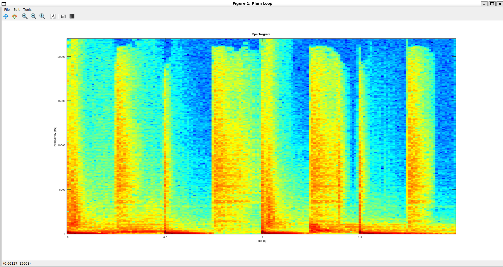
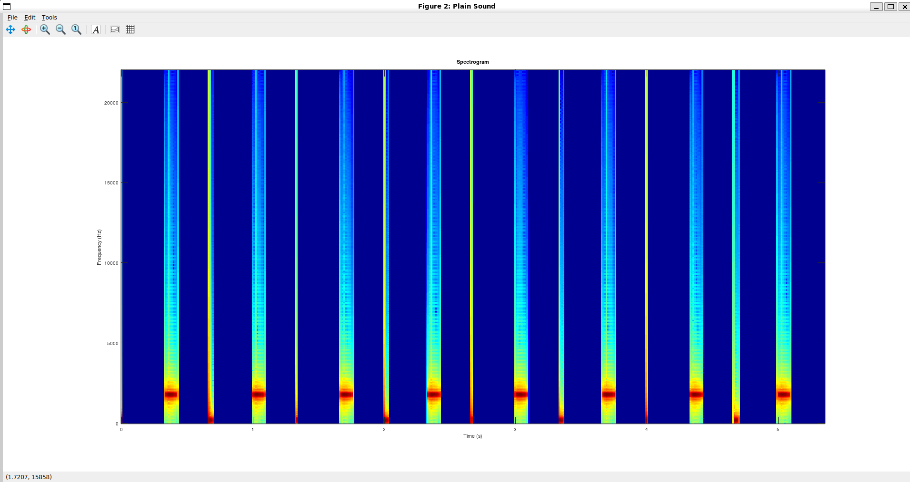
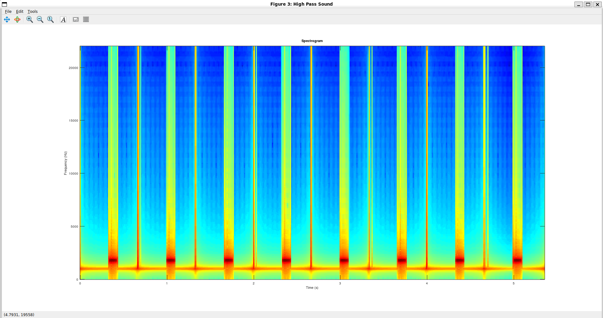
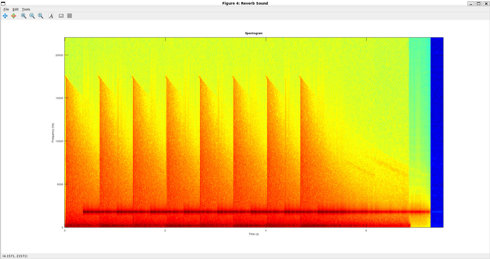
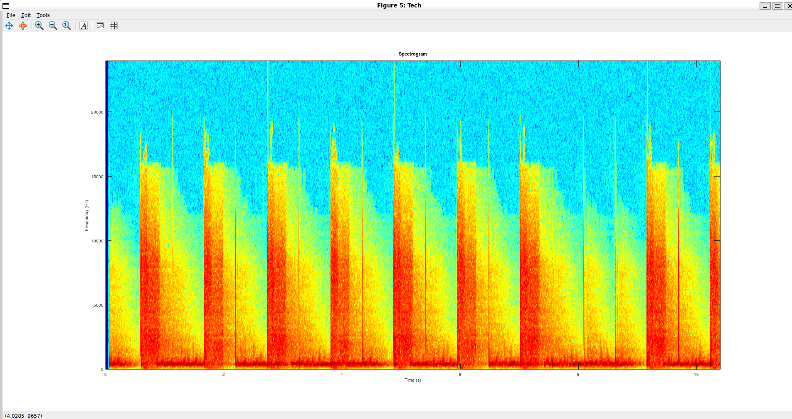
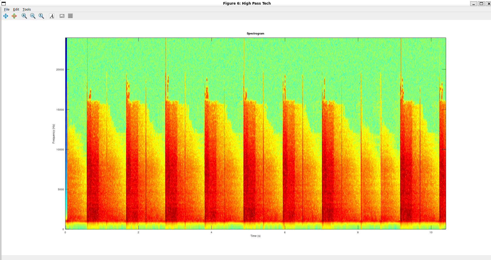
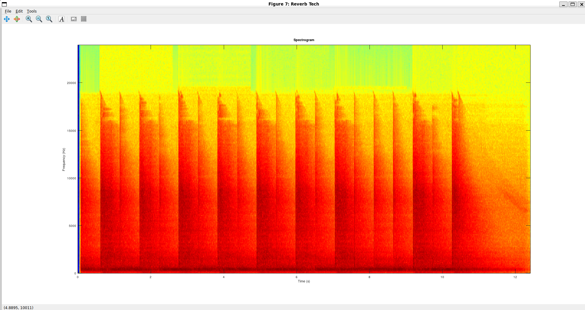
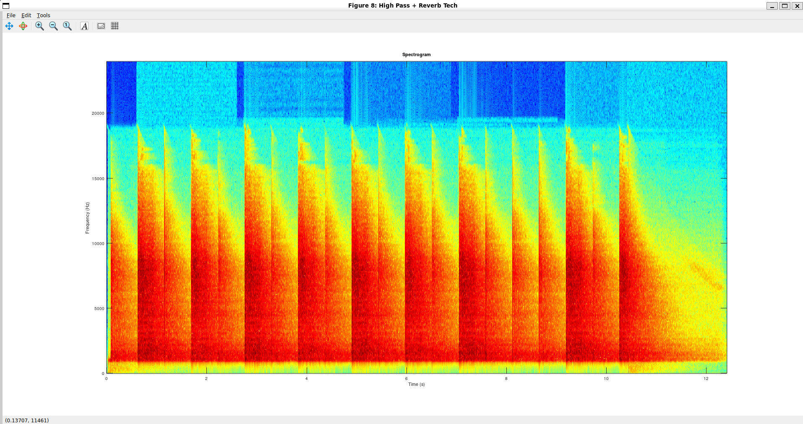
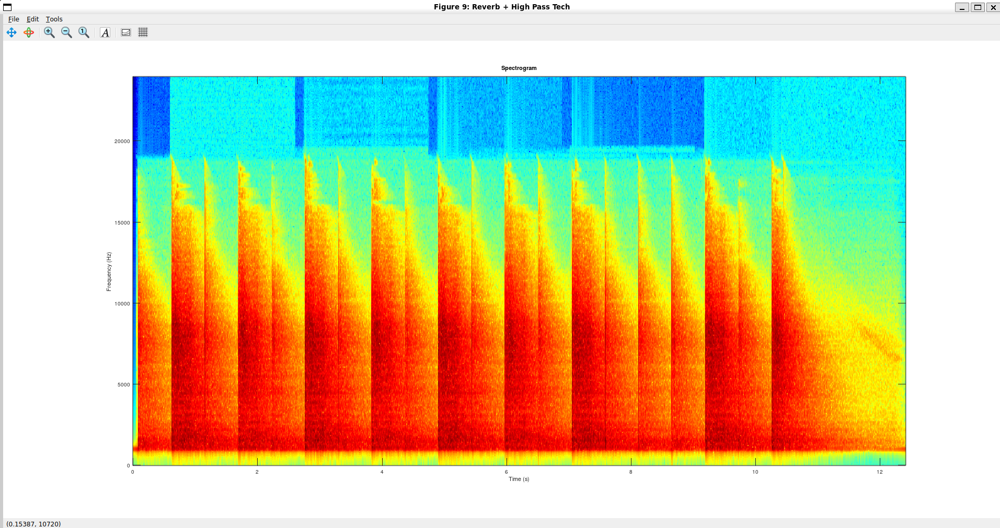

Audio Signal Processing – Mini DAW Simulation
Abstract
This project introduces fundamental concepts of audio signal processing through MATLAB/Octave.
We implement core building blocks that resemble how a digital audio workstation (DAW) such as FL Studio or Ableton works:
- Converting stereo to mono signals
- Visualizing sound with spectrograms
- Synthesizing audio with oscillators and ADSR envelopes
- Filtering with frequency-domain high-pass filters
- Adding reverberation using convolution with impulse responses

The provided script studio.m allows testing the functions, generating sounds, applying filters, and visualizing results.

Implemented Functions:
1. stereo_to_mono(stereo)
Converts a multi-channel (stereo) signal to mono.
Uses mean(stereo,2) to average channels.
Normalizes the result so maximum amplitude is 1.
Ensures safe playback across all speakers.

2. spectrogram(signal, fs, window_size)
Computes and returns the spectrogram of a signal using the Short-Time Fourier Transform (STFT).
Steps:
Signal is divided into windows of length window_size.
Each window is multiplied by a Hann window (hanning).
FFT is computed at double resolution, discarding conjugate symmetry.
Returns matrix S, frequency vector f, and time vector t.

Comment on results:
Shorter windows give better time resolution but blur frequencies.
Larger windows improve frequency detail but smear rapid changes.
This trade-off is clearly visible when comparing spectrograms in studio.m.

3. plot_spectrogram(S, f, t, window_title)
Visualizes spectrograms using imagesc with a logarithmic amplitude scale (log10).
Frequency on y-axis, time on x-axis.
Color intensity shows amplitude (blue = weak, red = strong).

4. oscillator(freq, fs, dur, A, D, S, R)
Generates artificial sounds with a sine wave oscillator shaped by an ADSR envelope.
Attack, Decay, Sustain, Release times define amplitude evolution.
Produces realistic instrument-like tones instead of plain sine waves.

Comment on results:
Short attack sound starts sharply (percussive).
Long release sound fades slowly (ambient effect).

Sustain controls how “full” the sound feels while held.

5. high_pass(signal, fs, cutoff_freq)
Implements a primitive high-pass filter in the frequency domain.
FFT of signal computed.
Frequencies below cutoff set to zero.
Symmetry of FFT preserved.
Inverse FFT reconstructs the time-domain filtered signal.
Signal normalized for safe playback.

Comment on results:
Low rumbles (bass) are removed.
High-frequency elements like hi-hats remain clear.
Can be compared with spectrograms before/after filtering.

6. apply_reverb(signal, impulse_response)
Adds reverberation effect by convolving the signal with an impulse response (IR).
IR first converted to mono.
fftconv used for efficient convolution.
Output normalized.
Comment on results:
Dry sound feels “flat” and “close”.
With reverb, sound gains depth and space.
Using different IRs (church, cave, room) drastically changes spatial perception.

7. create_instruments & parse_pattern
Support functions for reading instrument definitions and rhythmic patterns from .csv files.
Instruments synthesized with oscillator.
Patterns define when each instrument plays (kick, snare, hi-hat, etc.).
Combined with create_sound, they produce full drum loops.

8. create_sound(filename)
Reads tempo, sampling rate, instruments, and patterns from .csv.
Generates final track as a normalized mono signal.
Can be exported to .wav for playback.

Analiza spectograme:
Plain loop: 
    Un semnal natural cu zgomot de fundal. Are un spectru larg, este un semnal 
    complex.
    
Plain sound (generat de oscillator): 
    Un semnal ideal, construit cu sinusoide. Se observa concentrarea in jurul
    frecventei fundamnetale (aproximativ 2000 Hz) si intervalele de timp 
    folosite separate de benzile cu albastru inchis.
    
High pass sound (prelucrat cu high_pass):
    Observam ca sub frecventa de taiere (aproximativ 1000 Hz) se elimina sunetul,
    ramanand doar frecventele inalte.
    
Reverb sound (prelucrat cu apply_reverb):
    Se observa un semnal ecou care umple spatiul. Dupa fiecare spike, apare o 
    umbra care decade treptat in timp, frecventele joase persistand mai mult.
    Intervalele de timp goale din Plain sound acum sunt umplute cu un fundal
    difuz, reprezentand reflexiile reverb-ului.
    

Rezultate similare observam si pentru tech.wav in urma prelucrarilor cu ajutorul
functiilor high_pass si apply_reverb:
    
    
    
    
    

Observatie: High pass + reverb 
    Combina eliminarea basului cu efectul de ecou: frecventele joase dispar,
    iar reverberatia umple banda inalta cu decay gradual

Comparatii:
    Sunet natural vs oscilator (Plain Loop vs Plain Sound):
    Semnalul natural are un spectru larg, dens si zgomot de fundal, iar semnalul
    generat de oscillator este pur, cu energie concentrata doar in jurul
    frecventei fundamentale (~2000 Hz).
    
    Sunet original + prelucrat cu high pass: 
    Cel original contine atat frecvente joase cat si inalte, iar dupa aplicarea 
    filtrului high-pass componentele sub pragul de taiere (~1000 Hz) dispar,
    ramanand doar frecventele inalte.

    Sunet original + prelucrat cu reverb:
    Cel original prezinta spike-uri discrete fara coada sonora, in timp ce
    Reverb Sound adauga dupa fiecare spike o umbra care scade gradual si umple
    golurile cu un fundal sonor persistent, mai pronuntat in frecventele joase.
